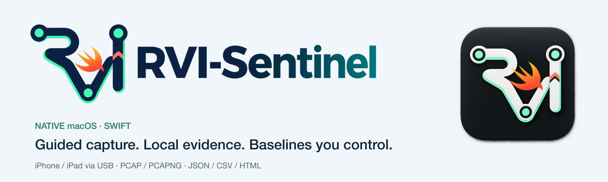
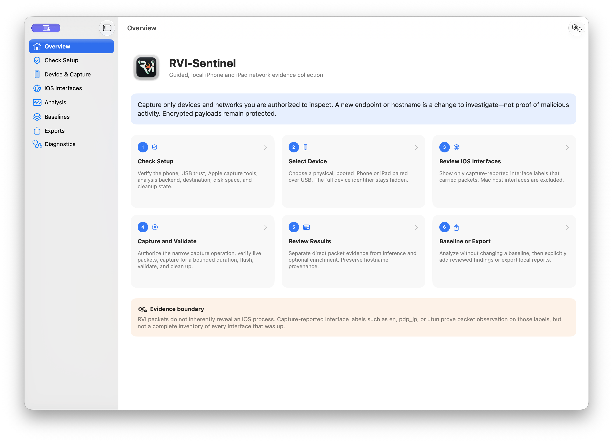
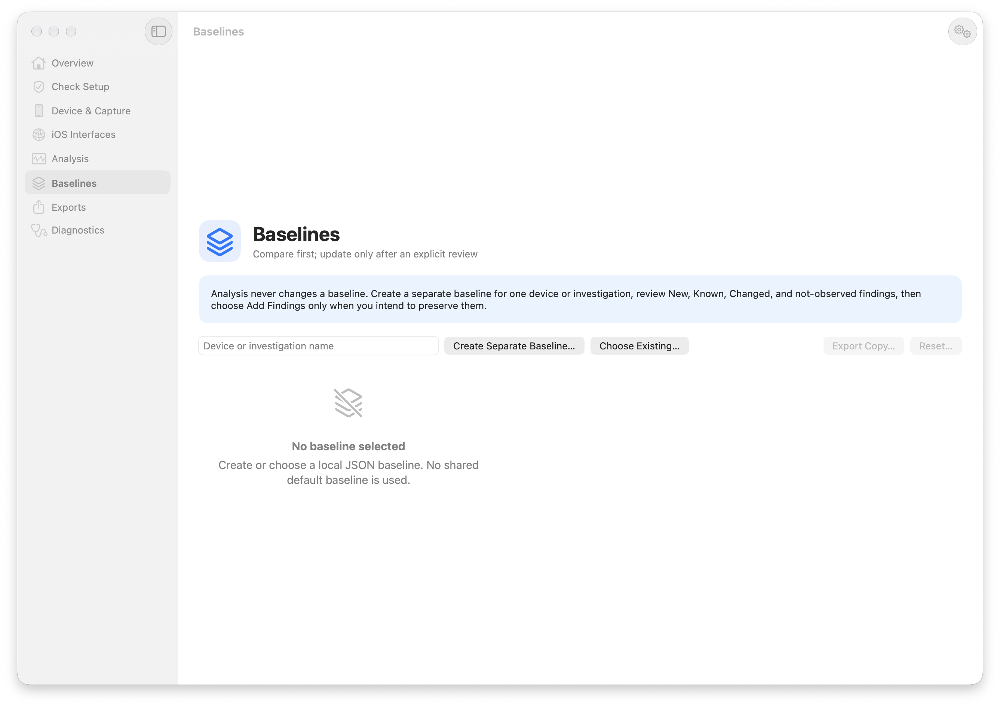
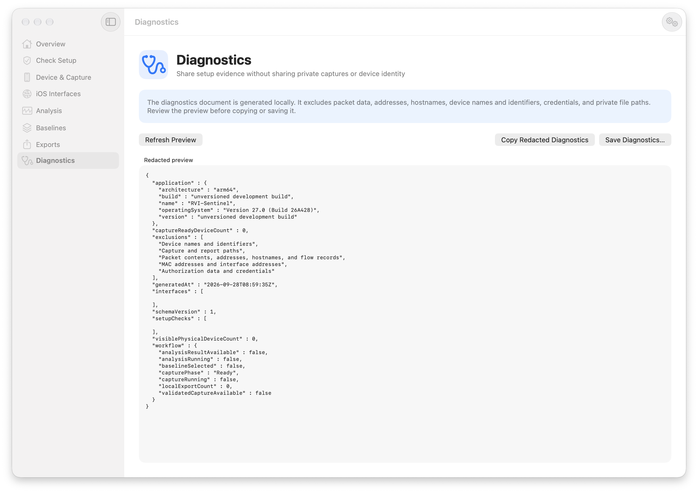
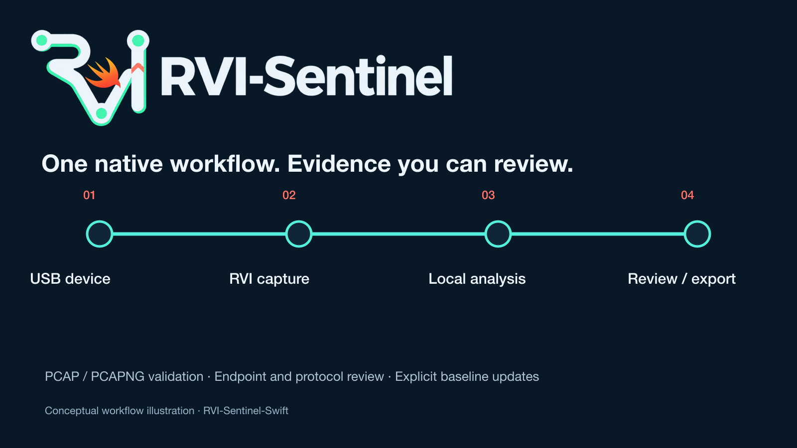
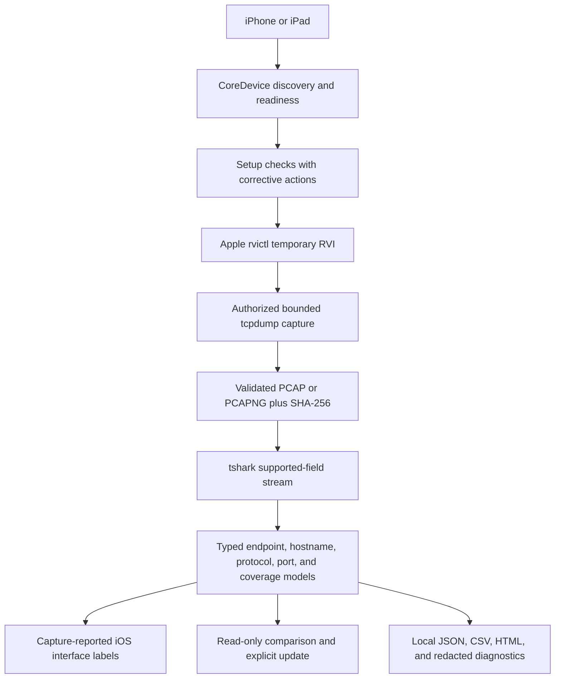

# RVI-Sentinel for macOS

### Native SwiftUI iPhone/iPad packet capture, evidence review, and persistent network baselining

<p align="center">
  <picture>
    <source media="(prefers-color-scheme: dark)" srcset="assets/branding/readme-header-dark.png">
    
  </picture>
</p>


> **Scope:** RVI-Sentinel for macOS is a defensive, local-first application for authorized iPhone and iPad packet capture and analysis. It guides a user through Apple's Remote Virtual Interface workflow, validates the saved capture, explains observable network metadata, and keeps persistent baselines under explicit user control.

This is a separate native macOS edition. It does not replace the cross-platform [Python RVI-Sentinel](https://github.com/hideouts-io/RVI-Sentinel).

---

## Table of Contents

- [Overview](#overview)
- [Native App Screenshots](#native-app-screenshots)
- [What It Does](#what-it-does)
- [Architecture](#architecture)
- [Requirements](#requirements)
- [Build and Run](#build-and-run)
- [Guided iPhone/iPad Capture](#guided-iphoneipad-capture)
- [Analyze an Existing Capture](#analyze-an-existing-capture)
- [Analysis and Protocol Coverage](#analysis-and-protocol-coverage)
- [Hostname Resolution and Provenance](#hostname-resolution-and-provenance)
- [iOS Interface Evidence](#ios-interface-evidence)
- [Protected Baselines](#protected-baselines)
- [Exports and Diagnostics](#exports-and-diagnostics)
- [Testing](#testing)
- [Repository Structure](#repository-structure)
- [Privacy and Responsible Use](#privacy-and-responsible-use)
- [Evidence Boundaries](#evidence-boundaries)
- [Relationship to the Python Edition](#relationship-to-the-python-edition)
- [License](#license)

---

## Overview

RVI-Sentinel turns Apple's command-line RVI capture process into a guided native workflow for people who do not live in Terminal. The app checks the Mac and connected device, requests macOS authorization only for the bounded packet-capture operation, verifies that packets are actually arriving, and makes capture completion unmistakable.

Capture and analysis remain separate:

> A PCAP records one authorized session. Analysis explains what was observable. A baseline shows what changed after review.

The analysis workspace accepts `.pcap`, `.pcapng`, and `.cap` files from any authorized source. A connected iPhone or iPad is required for live RVI capture, but not for reviewing an existing capture.

### Direct capability vs. interpretation

| Type | Meaning |
|---|---|
| **Direct capability** | Discovers physical Apple mobile devices through CoreDevice and excludes simulators. |
| **Direct capability** | Creates a temporary RVI, captures with macOS `tcpdump`, validates with `capinfos`, and removes the RVI. |
| **Direct capability** | Streams supported fields from `tshark` into typed endpoint, hostname, protocol, port, and coverage models. |
| **Direct capability** | Exports local JSON, CSV bundles, and HTML reports with hashes and provenance. |
| **Interpretation boundary** | A new endpoint, hostname, protocol, or port is a change to investigate—not proof of malicious behavior. |
| **Visibility boundary** | RVI does not defeat TLS, QUIC, VPNs, Private Relay, encrypted DNS, ECH, or application-layer encryption. |

---

## Native App Screenshots

The screenshots below show privacy-safe application states. They contain no private capture, endpoint inventory, hostname evidence, device identifier, baseline, or local investigation path.

### Guided workflow overview



The Overview presents capture as a six-step workflow and states the process/interface evidence boundary before analysis begins.

### Review-before-update baselines



Analysis never silently changes a baseline. Each device or investigation can use a separate local baseline, and reviewed findings are added only through an explicit action.

### Redacted diagnostics



Diagnostics are generated locally and deliberately exclude packet data, addresses, hostnames, device names and identifiers, credentials, and private file paths.

---

## What It Does



- Provides a native SwiftUI workflow for setup, device selection, capture, analysis, baselining, export, and diagnostics.
- Detects physical, booted, paired iPhones and iPads connected over USB; simulators are excluded.
- Checks device visibility, USB transport, pairing, Apple developer support, `rvictl`, `rpmuxd`, `tcpdump`, `tshark`, `capinfos`, output permissions, disk space, required macOS tools, and orphaned RVI state.
- Captures one selected device for a bounded duration from 5 seconds to 60 minutes.
- Supports PCAP and PCAPNG output without overwriting existing evidence.
- Starts the visible timer only after administrator authorization and a successful five-second live-packet preflight.
- Distinguishes no observed traffic from a disconnected or untrusted device.
- Validates the saved format, readable packet content, packet count, file size, packet-span duration, and SHA-256 hash.
- Shows an explicit completion card with **Analyze**, **Open File Location**, and **Capture Again** actions.
- Analyzes IPv4/IPv6 endpoints, hostnames, protocols, detailed fields, TCP/UDP ports, packet counts, byte counts, timing, and decoder coverage.
- Performs IPv4 and IPv6 hostname resolution and labels actively resolved names as post-capture enrichment.
- Shows capture-reported iOS interface labels while excluding the temporary Mac-side `rvi` interface.
- Keeps baseline comparison read-only until **Add Findings to Baseline** is chosen.
- Creates timestamped backups before baseline update or reset.
- Produces local JSON, CSV, and HTML reports and privacy-redacted diagnostics.
- Keeps full device identifiers and other expert detail behind **Advanced Details**.

---

## Architecture



<details>
<summary>Text-only architecture</summary>

```text
iPhone / iPad over USB
        |
        v
CoreDevice readiness checks
        |
        v
rvictl -> temporary rviN -> authorized tcpdump
        |
        v
validated PCAP / PCAPNG + SHA-256
        |
        v
tshark supported-field stream
        |
        +--> endpoints and active IPv4/IPv6 names
        +--> captured hostname provenance
        +--> protocols, detailed fields, and ports
        +--> observed iOS interface labels
        +--> explicit baseline review/update
        +--> local JSON / CSV / HTML exports
```

</details>

The source separates pure parsing and evidence classification from connectors that invoke macOS and Wireshark tools. Unsupported TShark fields are recorded as coverage gaps instead of being interpreted as proof that an activity did not occur.

---

## Requirements

| Requirement | Purpose |
|---|---|
| macOS 14 or later | Native SwiftUI application target |
| Xcode with Swift 6 support | Build, CoreDevice command access, and Apple device support |
| Physical iPhone or iPad | Live RVI capture; simulators are intentionally excluded |
| Data-capable USB cable and trusted pairing | Device discovery and capture readiness |
| `/Library/Apple/usr/bin/rvictl` | Apple Remote Virtual Interface lifecycle |
| macOS `/usr/sbin/tcpdump` | Local packet capture |
| Wireshark `tshark` and `capinfos` | Packet decoding and exact capture statistics |
| Administrator approval | Requested by macOS only for the narrow capture command |

Install current Wireshark from [wireshark.org](https://www.wireshark.org/download.html). The app resolves these external tools at runtime and does not bundle or redistribute them.

---

## Build and Run

Clone the native repository:

```bash
git clone https://github.com/hideouts-io/RVI-Sentinel-Swift.git
cd RVI-Sentinel-Swift
```

Build from Terminal without a signing identity:

```bash
xcodebuild \
  -project RVISentinel.xcodeproj \
  -scheme RVISentinel \
  -configuration Debug \
  -derivedDataPath DerivedData \
  CODE_SIGNING_ALLOWED=NO \
  build
```

Open the built application:

```bash
open DerivedData/Build/Products/Debug/RVI-Sentinel.app
```

You can also open `RVISentinel.xcodeproj` in Xcode and run the `RVISentinel` scheme. The checked-in Xcode project is ready to build; XcodeGen is needed only when regenerating it after editing `project.yml`.

---

## Guided iPhone/iPad Capture

1. Connect the iPhone or iPad directly with a data-capable USB cable.
2. Unlock the device, approve the accessory connection, and choose **Trust** if prompted.
3. Open **Check Setup** and run the readiness checks. Every failure includes a specific corrective action and evidence source.
4. Open **Device & Capture**, select a capture-ready physical device, choose a duration and PCAP/PCAPNG format, and choose a local destination.
5. Start the guided capture and approve the native macOS administrator dialog. RVI-Sentinel never asks for, reads, stores, or transmits the password.
6. During the five-second traffic check, open a webpage or another network activity on the phone if it is idle. The capture timer does not begin until a live packet is verified.
7. At the requested deadline, the app asks the capture process to flush, waits for finalization, bounds any process that remains alive, and validates the result.
8. Review the completion card: packet count, file size, actual packet span, saved location, RVI source, cleanup state, and SHA-256 are shown before the next action.

The temporary RVI is cleaned up after success, cancellation, or failure. If the capture is valid but RVI cleanup needs attention, the app preserves the evidence and reports partial success rather than discarding the capture.

---

## Analyze an Existing Capture

Open **Analysis**, choose an authorized `.pcap`, `.pcapng`, or `.cap` file, and select **Analyze Capture**. The source file is read-only: analysis does not rewrite the capture or silently update a baseline.

The result workspace contains:

- **Summary:** packet and byte totals, timestamps, capture SHA-256, decoder version, interface metadata, and active-resolution state.
- **Endpoints:** IPv4/IPv6 addresses, scope classification, source/destination observations, traffic totals, protocols, ports, process-attribution boundary, resolved names, and name provenance.
- **Hostnames:** captured and actively resolved names with related address, first/last observation, confidence, and evidence source.
- **Protocols:** packet and byte counts by identified protocol.
- **Protocol Details:** typed TShark field values, occurrence counts, and evidence boundaries.
- **Ports:** TCP/UDP observations with conventional service labels and an explicit reminder that a port does not prove an application or process.
- **Coverage:** supported and unsupported fields, decoder version, active-resolution behavior, and analysis limitations.

---

## Analysis and Protocol Coverage

RVI-Sentinel asks the installed TShark for its field catalog and requests only fields that version supports. Coverage depends on what the capture contains, what encryption leaves visible, and what the installed TShark can decode.

| Layer or family | Examples of preserved metadata when visible |
|---|---|
| Ethernet and VLAN | MAC addresses, EtherType, VLAN identifiers |
| ARP | IPv4/MAC mappings and operation codes |
| IPv4 and IPv6 | Addresses, TTL/hop limit, DSCP/ECN, fragmentation, next-header values |
| ICMP and ICMPv6 | Types, codes, neighbor discovery, router lifetime |
| TCP | Ports, flags, sequence/acknowledgment, RTT, retransmissions, resets, window state |
| UDP | Ports, stream identifiers, and datagram lengths |
| DNS, mDNS, and DNS-SD | Queries, answers, A/AAAA, CNAME, PTR, record type, response code, TTL |
| DHCP and DHCPv6 | Message type, assigned address, server/client identifiers |
| TLS and certificates | Visible SNI, version, cipher suite, ALPN, subject, issuer, SAN, serial |
| HTTP and HTTP/2 | Host/authority, method, URI/path, status, content type, stream/frame metadata when visible |
| HTTP/3 and QUIC | Recognizable protocol metadata, version, connection IDs, and packet numbers when exposed |
| STUN, TURN, WebRTC, DTLS | NAT traversal, mapped address, username, channel, and handshake metadata |
| RTP and RTCP | SSRC, sequence, timestamp, payload, and control types |
| SMB, SSH, and NTP | Visible operation, protocol, filename, reference, and stratum metadata |
| ESP/IPsec, WireGuard, and VPNs | Recognizable tunnel metadata, endpoints, timing, and traffic volume |
| Other recognized protocols | SSDP/UPnP, LLMNR, WebSocket, SCTP, GRE, IP-in-IP, MQTT, CoAP, OCSP, Kerberos, LDAP, FTP, TFTP, SIP, and Apple Push metadata |

Encrypted payloads remain encrypted. Protocol recognition, ports, certificate names, and hostnames are metadata—not authorization to decrypt protected content and not proof of which iOS process generated a flow.

---

## Hostname Resolution and Provenance

The native analyzer currently creates separate hostname-evidence records for:

- captured DNS query or answer;
- captured mDNS and DNS-SD names when the packet metadata or service-name pattern directly establishes that source;
- captured PTR answer;
- TLS SNI;
- HTTP Host, HTTP/2 authority, or HTTP/3 authority;
- certificate DNS subject alternative names;
- TLS SNI carried by a captured QUIC handshake;
- active IPv4/IPv6 reverse resolution.

These labels come from decoded capture fields, not from ports or vendor guesses. Certificate subjects without a DNS SAN are not promoted to hostnames, and a QUIC classification by itself does not create hostname evidence.

Active resolution is always enabled during analysis through TShark. Observed IP addresses may therefore be sent to the Mac's configured resolver. Names returned by that lookup are marked **Active reverse lookup**, **Low confidence**, and **Post-capture enrichment** so they are never confused with names directly present in the capture.

A missing PTR record means only that the resolver returned no reverse name. A returned PTR name can be generic, shared, stale, or controlled by a provider; it is an attribution hint, not proof of ownership or intent.

---

## iOS Interface Evidence

The **iOS Interfaces** workspace is populated only after analysis and only from capture-reported `frame.interface_name` values. It can describe observed labels such as:

```text
enN       Ethernet or Wi-Fi path label
pdp_ipN   Cellular packet-data path label
utunN     Tunnel or VPN path label
ipsecN    IPsec path label
awdlN     Apple Wireless Direct Link label
llwN      Apple low-latency wireless label
loN       Loopback label
```

The temporary Mac-side `rviN` transport is excluded from the iOS list.

An interface row means that packets were observed with that label. It does **not** prove that every absent interface was down, that the capture saw every active interface, or that name-based classification proves an internal iOS route beyond the captured metadata.

---

## Protected Baselines

Baselines are separate local JSON files scoped to one device or investigation. There is no shared default baseline.

1. Create or select a baseline.
2. Analyze a capture without changing the baseline.
3. Review **New**, **Known**, **Changed**, and **Not observed in this capture** findings.
4. Choose **Add Findings to Baseline** only after review.

A timestamped recovery copy is written before an update or reset. Baseline export creates another local copy; it never embeds the original PCAP.

New does not mean malicious. Mobile-device network infrastructure changes naturally because of roaming, CDNs, cloud services, software updates, DNS answers, VPNs, and application behavior.

---

## Exports and Diagnostics

### Local reports

- **JSON** preserves the typed analysis report and coverage metadata.
- **CSV bundle** creates separate inventories and a SHA-256 manifest.
- **HTML** creates a readable local report.

Every export records its own hash. The source capture is not rewritten or embedded, and exports do not perform additional hostname lookups.

### Redacted diagnostics

The diagnostics preview can be reviewed before it is copied or saved. It excludes:

- capture contents and report paths;
- endpoint IP and MAC addresses;
- captured or resolved hostnames;
- device names and identifiers;
- credentials and authorization data;
- private filesystem paths.

Diagnostics are for troubleshooting application readiness and workflow state, not for exporting investigation evidence.

---

## Testing

Build the app and test bundle:

```bash
xcodebuild \
  -project RVISentinel.xcodeproj \
  -scheme RVISentinel \
  -derivedDataPath DerivedData \
  build-for-testing \
  CODE_SIGNING_ALLOWED=NO
```

Run the compiled test suite:

```bash
xcodebuild \
  -project RVISentinel.xcodeproj \
  -scheme RVISentinel \
  -derivedDataPath DerivedData \
  test-without-building \
  CODE_SIGNING_ALLOWED=NO
```

The XCTest host is explicitly excluded from the application's single-instance enforcement, so the suite can run while the normal app is open. Ordinary launches still activate the existing app instead of opening a duplicate instance.

The standard suite covers typed parsing, TShark integration, device discovery, simulator exclusion, readiness checks, capture command construction and finalization, format validation, interface evidence, hostname provenance, protected baselines, local exports, and diagnostic redaction. The physical workflow test is opt-in because it requires an authorized local capture:

```bash
RVI_SENTINEL_PHYSICAL_CAPTURE=/path/to/authorized-capture.pcapng \
xcodebuild \
  -project RVISentinel.xcodeproj \
  -scheme RVISentinel \
  -derivedDataPath DerivedData \
  test \
  -only-testing:RVISentinelTests/PhysicalWorkflowTests \
  CODE_SIGNING_ALLOWED=NO
```

Never use a private capture in CI or commit it to the repository.

---

## Repository Structure

```text
RVI-Sentinel-Swift/
├── Sources/RVISentinel/
│   ├── AppState.swift                 # Application workflow state
│   ├── DeviceDiscovery.swift          # CoreDevice physical-device discovery
│   ├── SetupChecker.swift             # Readiness checks and corrective actions
│   ├── CaptureCoordinator.swift       # RVI, authorization, capture, validation, cleanup
│   ├── TSharkAnalyzer.swift           # Supported-field streaming adapter
│   ├── PacketAnalysis.swift           # Pure evidence accumulation and classification
│   ├── ProtocolDetails.swift          # Protocol field descriptions and boundaries
│   ├── InterfaceInventory.swift       # Host inventory and capture-reported iOS labels
│   ├── BaselineStore.swift            # Explicit protected baseline operations
│   ├── ReportExporter.swift           # JSON, CSV, HTML, and hashes
│   ├── DiagnosticsModels.swift        # Privacy-redacted diagnostics
│   └── *View.swift                    # Native SwiftUI workspaces
├── Tests/RVISentinelTests/
│   ├── PhysicalWorkflowTests.swift    # Opt-in authorized-capture integration path
│   └── *Tests.swift                   # Capture, analysis, baseline, export, and privacy tests
├── assets/
│   ├── rvi-sentinel-swift-logo-circular.png # Native app and repository logo
│   └── rvi-sentinel-logo.png                # Original published logo
├── evidence/
│   ├── rvi-sentinel-swift-overview.png
│   ├── rvi-sentinel-swift-baselines.png
│   └── rvi-sentinel-swift-diagnostics.png
├── captures/                          # Ignored private evidence
├── baselines/                         # Ignored local state
├── exports/                           # Ignored generated reports
├── project.yml                        # XcodeGen source configuration
├── RVISentinel.xcodeproj/
├── README.md
└── LICENSE
```

---

## Privacy and Responsible Use

Packet captures can reveal sensitive metadata even when payloads are encrypted. The repository ignores packet-capture formats, local GeoIP databases, logs, and files placed in its `captures/`, `baselines/`, and `exports/` directories. Endpoint inventories, hostnames, device identifiers, baselines, reports, and any other sensitive artifacts stored elsewhere are not automatically protected and must never be committed or published in issues or pull requests.

RVI-Sentinel does not upload captures or reports. All capture, analysis, baselining, export, and diagnostic generation is local. The important exception is active hostname resolution: observed IPv4 and IPv6 addresses may be sent to the Mac's configured DNS resolver during analysis.

Use RVI-Sentinel only with devices, networks, and packet captures you own or are explicitly authorized to inspect.

---

## Evidence Boundaries

- A network observation is not a malicious verdict.
- A conventional port label is context, not proof of an application or service.
- A resolved hostname is an attribution hint, not proof of ownership or intent.
- An observed interface label is not a complete inventory of iOS interfaces.
- Ordinary RVI traffic does not inherently reveal the responsible iOS process.
- Unsupported or missing TShark fields are coverage gaps, not proof that activity was absent.
- Encrypted sessions still expose some endpoint, timing, volume, and handshake metadata, but their protected payload remains unavailable.

When no direct ownership evidence exists, the app reports that process attribution is unavailable instead of guessing from a hostname, port, vendor, or timing pattern.

---

## Relationship to the Python Edition

| Edition | Host support | Interface | Capture path | Repository |
|---|---|---|---|---|
| Native Swift edition | macOS only | SwiftUI | Apple `rvictl` + `tcpdump` | This repository |
| Python edition | macOS, Linux, and Windows | PySide6 + CLI | Apple RVI on macOS; separately installed `gh2o/rvi_capture` on Linux/Windows | [hideouts-io/RVI-Sentinel](https://github.com/hideouts-io/RVI-Sentinel) |

The two editions are independent applications. The Python project remains available for cross-platform capture and CLI workflows; the Swift project focuses on a native, guided macOS experience.

---

## License

RVI-Sentinel for macOS is MIT licensed. See [`LICENSE`](LICENSE). Apple system tools and Wireshark remain subject to their own licenses and distribution terms.
